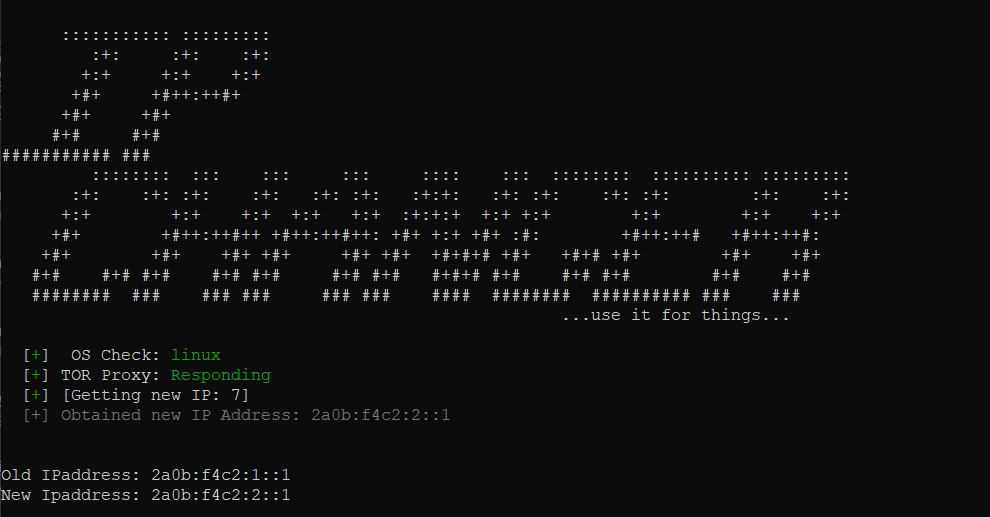

# IPChanger

## Description
IPChanger uses the TOR Controlport to request a new exit node, and will keep working until it gets one.  Essentially, this changes your external IP address each time IPChanger is run.  It does this via ControlPort commands, and then uses an external IP lookup site to validate your external IP address. You will then need to use something like proxychains (https://github.com/haad/proxychains) to leverage this new ipaddress. Duh



## Why use this tool?
* You want to map out the TOR network (probably a bad idea)
* You are trying to get around CAPTCHAs (probably a bad idea)
* 1 word: Girls LOVE TOR HACKERS (great idea)
* Because it was acceptable in the 80s (https://www.youtube.com/watch?v=dOV5WXISM24)

## Installation
Installation is easy and free:

When you sit back and think about it, IPChanger is pretty needy.  It expects a lot of things to be able to run correctly:
* Requires Linux Operating System because it needs to interact with TOR client via the control port, and mostly because I have not tested Windows or MacOS yet.  I have tested this on Debian and Kali, and it works great for me. If you need this to work on something else, I accept bitcoin or pull requests. 
* pip3 install -r requirements.txt 
* Requires TOR installed & working, and configured to allow ControlPort for controller applications. See TOR Configuration below to get this working
* Doesnt require ProxyChains to work, but requires ProxyChains to work -- if you know what I mean ;)

## Usage Instructions
You should try running it standalone before importing into your code, as it will check to make sure everything works as expected & operating environment is sane.
1. Works fine for standalone use

    ```sh
    $ python3 IPChanger.py 
    ```

2. Or as an import into your existing code

    ```py
    import IPChanger
    oldip, newip = IPChanger.getNewIP()
    print(f'OldIP: {oldip} | NewIP:{newip}')
    ```


## TOR Configuration Instructions 
1. Install Linux TOR Client:

    ```sh
    $ sudo apt install tor 
    ```

2. Generate the HashedControlPassword needed to control the Tor proxy:

    ```sh
    $ tor --hash-password ""
    ```

3. Edit the /etc/tor/torrc file and uncomment 'ControlPort', CookieAuthenication, and 'HashedControlPassword'. Replace the example hash with the hash you generated above:

    ```sh
    $ sudo nano /etc/tor/torrc
    ```
   The file should look similar to this (hash will be different)
    ```sh
    ## The port on which Tor will listen for local connections from Tor
    ## controller applications, as documented in control-spec.txt.
    ControlPort 9051
    ## If you enable the controlport, be sure to enable one of these
    ## authentication methods, to prevent attackers from accessing it.
    HashedControlPassword 16:238FDE9CC88B6265608CEB18405196EFDB15F7FD1100D0663B0498D223
    CookieAuthentication 1
    ```

4. Restart the Tor client:

    ```sh
    $ sudo service tor restart
    ```

## Proxychains usage
1. Lots of instructions & examples on the internet.. So try there.  This is just a simple example 

    ```sh
    $ python3 IPChanger.py && proxychains bash 
    ```
